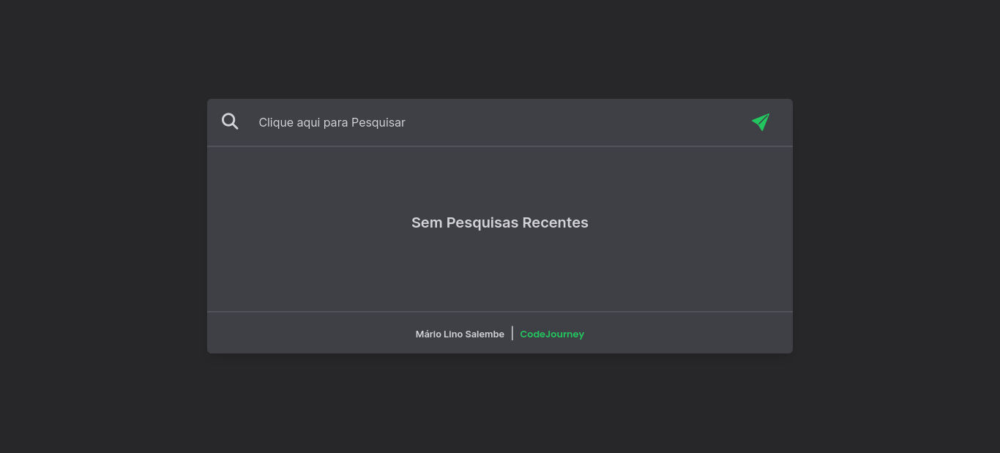
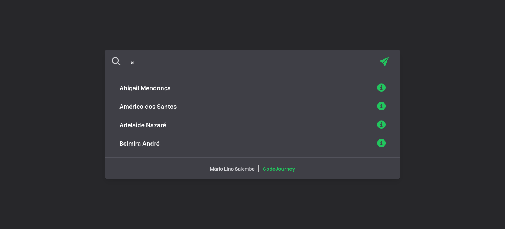
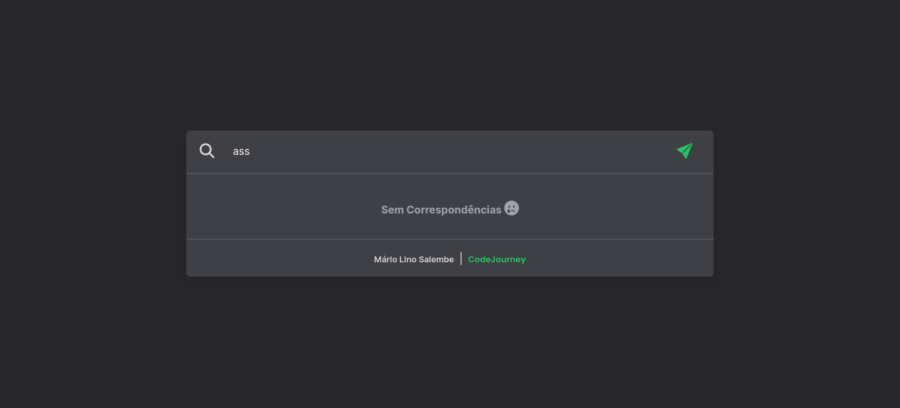

# Template
Neste Componente de Pesquisa Utilizei alguns Recursos populares como:
-- Tailwind CSS
-- GRID e FLEX CSS
-- Javascript DOM 
-- FETCH API

# LINKS
Github: https://github.com/mariosalembe23
Repositório: 
Live URL:

# Imagens

# What I learned?
Aprendi muitas Classes Personalizadas do Tailwind CSS que me Ajudaram a Construir este Componente
e a tratar os Dados de forma mais fáceis vindo de uma API(no meu Caso uma Fake API, eu mesmo Criei)

# Overview
Eu criei este componente para ajudar aqueles Desenvolvedores que gostam de coisas Prontas e modernas,
dando a Capacidade de então apenas dar um Ctrl+V e Ctrl+C. Foi um Bom Desafio.